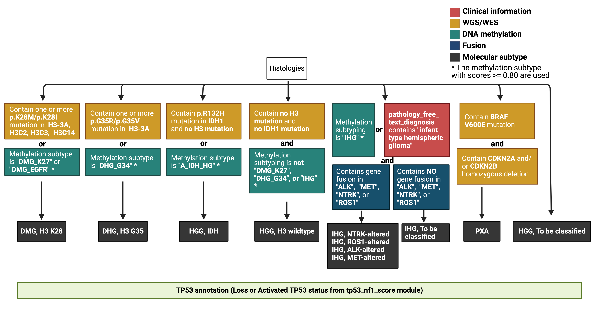

## Molecular subtyping for high-grade glioma (HGG) 

This module is adapted from: [`d3b-center/OpenPedCan-analysis`](https://github.com/d3b-center/OpenPedCan-analysis).


#### Running the analysis

The analysis can be run with the following (assuming you are in the analysis directory):

```
bash run-molecular-subtyping.sh
```

### Standard of HGG molecular subtype

1. If there was an _H3-3A_ K28M, _H3C2_ K28M, _H3C3_ K28M, _H3C14_ K28M, _H3-3A_ K28I, _H3C2_ K28I, _H3C3_ K28I or _H3C14_ K28I mutation -> `DMG, H3 K28`.
2. If there was an _H3-3A_ G35V or G35R mutation -> `HGG, H3 G35`.
3. If there was an _IDH1_ R132 mutation -> `HGG, IDH`.
4. If high-confidence methylation classification suggested one of the subtypes above (e.g. K28) --> `DMG, H3 K28`.
5. In `Hope-GBM-histologies_base.tsv`, column `pathology_free_text_diagnosis` contains `infant type hemispheric glioma` or `cns_methylation_subclass` == "IHG" -> `IHG`
    1. If there was a _NTRK_ fusion -> `IHG, NTRK-altered`
    2. If there was a _ROS1_ fusion -> `IHG, ROS1-altered`
    3. If there was a _ALK_ fusion -> `IHG, ALK-altered`
    4. If there was a _MET_ fusion -> `IHG, MET-altered`
    5. If there was no fusion -> `IHG, To be classified` based on IHG methylation classification and sample clinical report in the `pathology_diagnosis_free_text` stated as `infant type hemispheric glioma`.
6. Either in `Hope-GBM-histologies_base.tsv`, column `pathology_free_text_diagnosis` contains `malignant pxa", "pleomorphic xanthoastrocytoma`, `anaplastic pleomorphic xanthoastrocytoma with braf p.val600glu mutation, who grade iii`, `anaplastic pleomorphic xanthoastrocytoma, who grade 3` 
**or** 
`methylation_subclass == "PXA"`, 
**and** 
have _BRAF_ mutation or other MAPK pathway gene alteration, combined with homozygous deletion of _CDKN2A_ and/or _CDKN2B_. -> "PXA".
7. All samples that did not meet any of these criteria were marked as `HGG, H3 wildtype` (i.e. there was no canonical variant the DNA or methylation classification subtype). 
8. Remaining samples with no DNA or methylation were categorized as `HGG, To be classified`.


**TP53 status**
Based on the results from `tp53_nf1_score` module, if `tp53_altered` is either `activated` or `loss`, add `TP53` after molecular subtype; otherwise, molecular subtype keep as it is. 

## Molecular subtyping HGG workflow




### Order of analysis

`00-fusion-summary.Rmd`: This script is adapted from `analyses/fusion-summary` and designed to generate fusion files specifically for HGG molecular subtyping. Input files needed for this script include `Hope-GBM-histologies-base.tsv`, `Hope-fusion-putative-oncogenic.rds`.  Output of this script is `input/fusion_summary_hgg_foi.tsv`, which contains the fusion that is needed for HGG molecular subtyping. 

`01-HOPE-HGG-subtyping-subset-file.Rmd`: This script is used to subset the files that are needed for HGG subtyping, including CNV, SV, SNV, and fusion data. 

####  output
  -  `results/Hope_HGG_defining_lesions.tsv`: This file contains the target lesions (H3 K28M/K28I/G35R/G35V) for HGG molecular subtyping.
  -  `results/HGG_cleaned_cnv.tsv`: This file contains the copy number variants (EGFR, PTEN, PDGFRA and MYCN) for subtyping. 
  -  `results/HGG_cleaned_mutation.tsv`: This file contains mutations related to `H3 K28 mutant`, `H3 G35 mutant`, `IDH mutant` and `H3.3 and IDH wildtype`. 
  -  `results/HGG_cleaned_fusion.tsv`: This file contains the fusion of interests (FGFR1, NTRK, MET, ROS1, and ALK). 
  -  `results/HGG_cleaned_expression.tsv`: This file contains the scaled expression of target genes (FOXG1, OLIG2, TP73_AS1, EGFR and EZHIP).

`02-HOPE-molecular-subtyping.Rmd`: This script follows WHO guidebook to assign the HGG molecular subtype. It takes the output from `01-HOPE-HGG-subtyping-subset-file.Rmd` and `tp53_nf1_score` module and assigns the molecular subtype to each HOPE cohort sample.

#### output
  -  `results/Hope_subtype.tsv`: This contains the subtyping results of each sample, with molecular subtype, methylation molecular subtype and TP53 status.

`03-molecular-subtype-integrate.R`: This script integrates the molecular subtyping results of samples from Hope cohort with `Hope-GBM-histologies-base.tsv` and generate `Hope-GBM-histologies.tsv`. 


#### Inputs files

All these files can be downloaded from s3, using `hope-cohort-analysis/download-data.sh` script. 

`Hope-GBM-histologies-base.tsv`
`Hope-fusion-putative-oncogenic.rds`
`Hope-tumor-only-snv-mutect2.maf.tsv.gz`
`Hope-snv-consensus-plus-hotspots.maf.tsv.gz`
`Hope-cnv-controlfreec-tumor-only.rds`
`Hope-cnv-controlfreec.rds`
